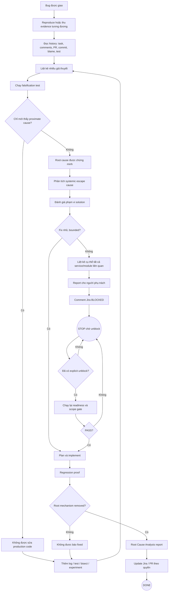
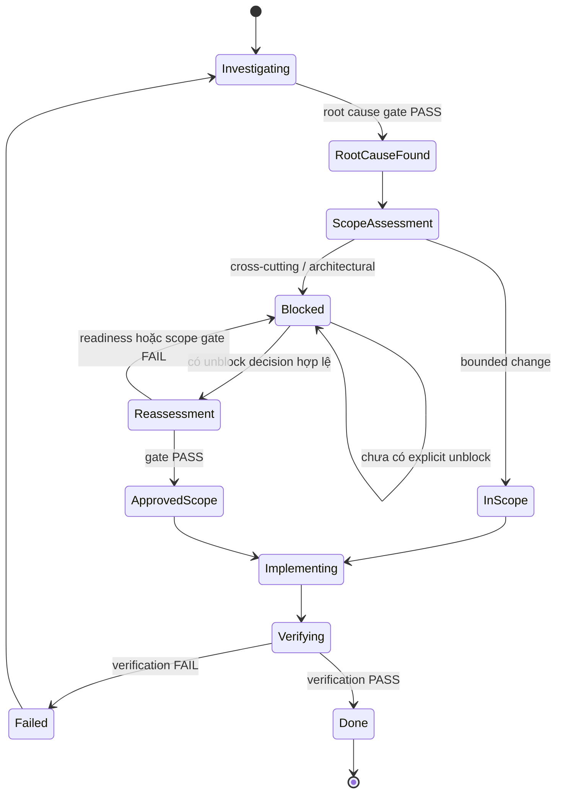

# Codex Daily Workflow Skills

Bộ skill này dùng Codex làm **executor có quy trình** trong terminal và Browser MCP khi chatbot chính chưa hoàn thiện.

Mục tiêu:

1. Codex có thể nhận task, bug hoặc đề xuất và tự chạy toàn bộ quy trình có kiểm soát.
2. Mỗi bước tạo evidence để chứng minh skill đã chạy đúng.
3. Không đoán khi thiếu dữ liệu; phải trả `UNKNOWN` hoặc dừng ở approval gate.
4. Mỗi lần chạy đều có thể đánh giá, cải thiện skill và tái sử dụng flow cho chatbot.
5. Chatbot sau này chỉ cần gọi lại cùng workflow contract, không phải phát minh lại quy trình.

## Cấu trúc

```text
skills/
  daily-workflow-orchestrator/
  work-intake/
  readiness-assessment/
  task-planning/
  code-execution/
  verification/
  browser-operations/
  delivery-report/
  workflow-retrospective/
templates/
  workflow-run.yaml
  benchmark.yaml
  evidence.schema.json
  daily-command.md
examples/
  bug-run.yaml
  task-run.yaml
```

## Flow chuẩn

```text
INTAKE
  -> READINESS
  -> PLAN
  -> EXECUTE
  -> VERIFY
  -> BROWSER OPERATIONS
  -> REPORT
  -> RETROSPECTIVE
```

Mỗi bước phải ghi:

- input đã dùng;
- command/tool đã gọi;
- file hoặc trang đã thay đổi;
- kết quả;
- evidence path;
- trạng thái `PASS | FAIL | UNKNOWN | BLOCKED | SKIPPED`;
- lý do và next action.

## Cách dùng nhanh

Dán nội dung `templates/daily-command.md` cho Codex hoặc gọi skill orchestrator:

```text
Use skill daily-workflow-orchestrator.
Run examples/task-run.yaml.
Do not skip gates.
Store evidence under .my-ai/runs/<run-id>/.
```

## Quy tắc bắt buộc

- Không sửa code trước khi readiness đạt PASS hoặc có explicit override.
- Không tự đổi requirement để làm cho test pass.
- Không sửa test chỉ để che lỗi implementation.
- Không push, tạo PR, comment Jira, đổi status hoặc gửi report khi chưa qua gate tương ứng.
- Browser MCP chỉ thao tác trên đúng issue/PR được chỉ định.
- Mọi thay đổi ngoài scope phải được ghi thành proposal riêng.
- Mỗi action phải idempotent hoặc kiểm tra trạng thái trước khi chạy lại.
- Khi không chắc chắn, trả `UNKNOWN`, không bịa.

## Bổ sung v2: nguồn gốc logic và lịch sử bug

### Feature mới

Trước khi code, Codex phải tạo `implementation-traceability.yaml` để chứng minh:

- behavior bắt nguồn từ AC/comment/contract nào;
- function mới vì sao cần tồn tại;
- tại sao không reuse code cũ;
- input/output/invariant dựa vào đâu;
- mỗi nhánh logic được phủ bởi test nào.

Không xác định được nguồn logic thì trạng thái là `UNKNOWN`, không được code.

### Bug

Trước khi fix, Codex phải đọc Git và tracker history:

- task/PR/commit nào tạo hoặc làm lộ bug;
- behavior trước và sau thay đổi;
- test nào đã thiếu;
- lỗi là introduced, exposed hay regressed.

Sau khi fix phải có:

- `bug-history.yaml`;
- `root-cause-analysis.md`;
- root cause classification;
- solution xử lý nguyên nhân;
- regression test fail trước fix và pass sau fix khi có thể.

## Bổ sung v3: không được fix nguyên nhân nhìn thấy ngay

Với bug, `proximate cause` chỉ là manh mối. Codex không được sửa production code
cho đến khi `root-cause-gate.yaml` đạt PASS.

Codex vẫn được:

- thêm log/instrumentation;
- viết reproduction test;
- chạy git bisect;
- tạo experiment;
- bác bỏ các giả thuyết cạnh tranh.

Codex chưa được:

- áp dụng production fix;
- báo Jira fixed;
- tạo PR hoàn tất;
- kết luận root cause từ log đầu tiên.

Một fix chỉ hợp lệ khi đồng thời:

```text
symptom removed
AND root mechanism removed
AND sibling failure modes covered
AND regression proof exists
```

## Bổ sung v4: scope escalation và tách subtask

Sau khi tìm root cause, Codex phải đánh giá phạm vi solution.

Nếu solution đúng là cross-cutting hoặc architectural, Codex không được sửa một đống
trong ticket bug nhỏ. Nó phải:

```text
Root cause found
  → Scope assessment
  → Stop large patch
  → Raise systemic-fix ticket
  → Create bounded subtasks
  → Link originating bug
  → Optional approved mitigation
```

Mitigation không được trình bày như final solution.

## Bổ sung v5: report, BLOCKED và dừng chờ unblock

Khi solution đúng ảnh hưởng nhiều service/module, Codex phải nêu chính xác từng
thành phần, đánh `BLOCKED`, comment Jira nếu được phép và dừng.

```text
Large scope detected
  → list exact impacted components
  → create escalation report
  → Jira blocked comment
  → status BLOCKED
  → STOP
  → wait for explicit unblock
```

Tạo ticket hoặc subtask không tự động cho phép Codex tiếp tục.

## Workflow tổng thể

```mermaid
flowchart TD
    A[Nhận task / bug / proposal] --> B[Work Intake<br/>Đọc issue, comments, AC, history liên quan]
    B --> C{Readiness PASS?}

    C -- Không --> C1[Report thiếu dữ liệu<br/>Status: UNKNOWN / BLOCKED]
    C1 --> C2[Comment Jira nếu được phép]
    C2 --> STOP1((STOP))

    C -- Có --> D{Loại công việc?}

    D -- Feature / Proposal --> E[Implementation Traceability]
    E --> E1[Map requirement → behavior → symbol → test]
    E1 --> E2{Nguồn logic rõ ràng?}

    E2 -- Không --> E3[Status: UNKNOWN<br/>Không được code]
    E3 --> STOP2((STOP))

    E2 -- Có --> P[Task Planning]

    D -- Bug --> F[Bug History Investigation]
    F --> F1[Đọc git log, blame, PR, task, comments, test history]
    F1 --> G[Root Cause Investigation]
    G --> G1[Phân biệt symptom / proximate cause / contributing conditions / root cause / escape cause]
    G1 --> G2{Root cause gate PASS?}

    G2 -- Không --> G3[Chỉ được thêm log, reproduction test,<br/>bisect và experiment]
    G3 --> G4[Status: ROOT_CAUSE_INVESTIGATION]
    G4 --> STOP3((STOP))

    G2 -- Có --> H[Scope Assessment]
    H --> H1{Scope loại nào?}

    H1 -- In scope / bounded --> P
    H1 -- Cross-cutting / Architectural --> I[Impact Inventory]
    I --> I1[Liệt kê cụ thể service, module, repo,<br/>symbol, contract, owner, risk]
    I1 --> I2[Scope Escalation Report]
    I2 --> I3[Comment Jira: BLOCKED]
    I3 --> I4[Status: BLOCKED<br/>Reason: SCOPE_EXCEEDS_CURRENT_TICKET]
    I4 --> STOP4((STOP))

    STOP4 --> J{Có explicit unblock decision?}
    J -- Không --> STOP4
    J -- Có --> J1[Đọc approved scope, authority,<br/>linked ticket và constraints]
    J1 --> J2[Chạy lại Readiness + Scope Gate]
    J2 --> J3{Gate PASS lại?}
    J3 -- Không --> STOP4
    J3 -- Có --> P

    P --> K[Code Execution]
    K --> L[Verification]
    L --> L1{Verification PASS?}

    L1 -- Không --> L2[Report FAIL / UNKNOWN / BLOCKED]
    L2 --> STOP5((STOP))

    L1 -- Có --> M{Bug hay Feature?}

    M -- Bug --> N[Hoàn thiện Root Cause Analysis]
    N --> N1[Chứng minh root mechanism removed<br/>+ sibling failure modes covered]
    N1 --> O[Browser Operations]

    M -- Feature --> O[Browser Operations]

    O --> O1[Update Jira / PR / links / report<br/>theo quyền được cấp]
    O1 --> Q[Delivery Report]
    Q --> R[Workflow Retrospective]
    R --> S((DONE))
```



## Workflow riêng cho bug



## Workflow scope lớn và BLOCKED



## Quy tắc đọc sơ đồ

- `STOP` nghĩa là Codex phải kết thúc run hiện tại, không tiếp tục implementation.
- Tạo ticket hoặc subtask không tự động gỡ `BLOCKED`.
- Chỉ `explicit unblock decision` có authority, approved scope và evidence mới cho phép chạy lại.
- Sau unblock vẫn phải chạy lại `readiness` và `scope gate`.
- Với bug, proximate cause không đủ điều kiện để sửa production code.
- Với scope lớn, Codex phải nêu chính xác service/module/repository bị ảnh hưởng trước khi dừng.
